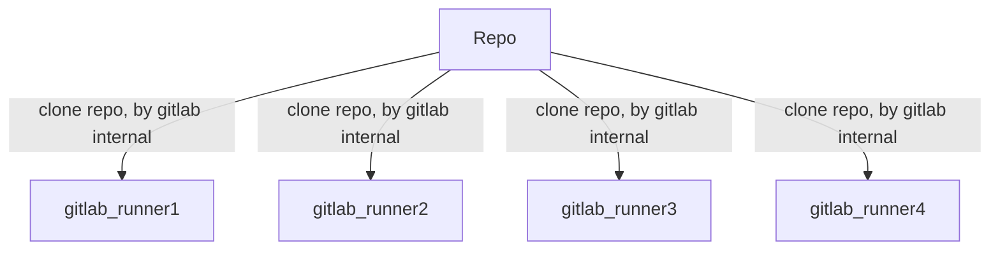

* content
{:toc}

cyberrange项目cr-vroute子系统gitlab CI/CD配置说明。

## 概览



图示解释：

gitlab runner从repo下拉代码。进行构建，测试等操作，其权限来自与runner配置时使用的token，不需要额外配置，只要正常注册了gitlab runner就可以，由gitlab帮我们搞定。

## 注册gitlab runner

根据文档运行gitlab-runner，并注册到相应的repo即可，参考[官方文档](https://docs.gitlab.com/ee/ci/)

### install gitlab-runner

#### install from apt

```bash
curl -L https://packages.gitlab.com/install/repositories/runner/gitlab-runner/script.deb.sh | sudo bash
apt-get install gitlab-runner
```

#### install from docker

1. 修改apt的源：

```
deb http://mirrors.aliyun.com/ubuntu/ trusty main restricted universe multiverse
deb http://mirrors.aliyun.com/ubuntu/ trusty-security main restricted universe multiverse
deb http://mirrors.aliyun.com/ubuntu/ trusty-updates main restricted universe multiverse
deb http://mirrors.aliyun.com/ubuntu/ trusty-proposed main restricted universe multiverse
deb http://mirrors.aliyun.com/ubuntu/ trusty-backports main restricted universe multiverse
deb-src http://mirrors.aliyun.com/ubuntu/ trusty main restricted universe multiverse
deb-src http://mirrors.aliyun.com/ubuntu/ trusty-security main restricted universe multiverse
deb-src http://mirrors.aliyun.com/ubuntu/ trusty-updates main restricted universe multiverse
deb-src http://mirrors.aliyun.com/ubuntu/ trusty-proposed main restricted universe multiverse
deb-src http://mirrors.aliyun.com/ubuntu/ trusty-backports main restricted universe multiverse
```

2. Update the `apt` package index and install packages to allow `apt` to use a repository over HTTPS:

```bash
$ su
$ apt-get -y update
$ apt-get -y upgrade
$ apt-get -y install \
    apt-transport-https \
    ca-certificates \
    curl \
    gnupg-agent \
    software-properties-common
```

3. Add Docker’s official GPG key:

```bash
curl -fsSL http://mirrors.aliyun.com/docker-ce/linux/ubuntu/gpg | sudo apt-key add -
```

Verify that you now have the key with the fingerprint`9DC8 5822 9FC7 DD38 854A E2D8 8D81 803C 0EBF CD88`, by searching for the last 8 characters of the fingerprint.

```bash
$ apt-key fingerprint 0EBFCD88
/etc/apt/trusted.gpg
--------------------
pub   1024D/437D05B5 2004-09-12
      Key fingerprint = 6302 39CC 130E 1A7F D81A  27B1 4097 6EAF 437D 05B5
uid                  Ubuntu Archive Automatic Signing Key <ftpmaster@ubuntu.com>
sub   2048g/79164387 2004-09-12

pub   1024D/FBB75451 2004-12-30
      Key fingerprint = C598 6B4F 1257 FFA8 6632  CBA7 4618 1433 FBB7 5451
uid                  Ubuntu CD Image Automatic Signing Key <cdimage@ubuntu.com>

pub   4096R/C0B21F32 2012-05-11
      Key fingerprint = 790B C727 7767 219C 42C8  6F93 3B4F E6AC C0B2 1F32
uid                  Ubuntu Archive Automatic Signing Key (2012) <ftpmaster@ubuntu.com>

pub   4096R/EFE21092 2012-05-11
      Key fingerprint = 8439 38DF 228D 22F7 B374  2BC0 D94A A3F0 EFE2 1092
uid                  Ubuntu CD Image Automatic Signing Key (2012) <cdimage@ubuntu.com>

pub   4096R/0EBFCD88 2017-02-22
      Key fingerprint = 9DC8 5822 9FC7 DD38 854A  E2D8 8D81 803C 0EBF CD88
uid                  Docker Release (CE deb) <docker@docker.com>
sub   4096R/F273FCD8 2017-02-22
```

4. Use the following command to set up the **stable** repository. To add the **nightly** or **test** repository, add the word `nightly` or `test` (or both) after the word `stable` in the commands below. [Learn about **nightly** and **test** channels](https://docs.docker.com/engine/install/).

```bash
$ add-apt-repository \
   "deb [arch=amd64] https://download.docker.com/linux/ubuntu \
   $(lsb_release -cs) \
   stable"
```

在尝试了几次之后发现这一步骤对ubuntu14.04.6并不适用，将源更换为阿里源后成功

```bash
$ add-apt-repository \
   "deb [arch=amd64]  
   http://mirrors.aliyun.com/docker-ce/linux/ubuntu \
   $(lsb_release -cs) \
   stable"
```

5. install docker engine

```bash
 $ apt-get -y update
 $ apt-get -y install docker-ce
 $ service docker start
```

### setup gitlab-runner

``` bash
# pull image
$ docker pull gitlab/gitlab-runner
Using default tag: latest
latest: Pulling from gitlab/gitlab-runner
d72e567cc804: Pull complete
0f3630e5ff08: Pull complete
b6a83d81d1f4: Pull complete
795a1e0f662d: Pull complete
e26343354a23: Pull complete
df2906232f5a: Pull complete
e9423d1eea92: Pull complete
45a5486ea8e3: Pull complete
Digest: sha256:07d7c6d82b11646aa048427fadd9a1c0e5faa1efcea7e06689eadcf9b52da006
Status: Downloaded newer image for gitlab/gitlab-runner:latest
```

### register gitlab-runner

* register gitlab-runner using docker

 参考：[configure gitlab-runner](https://docs.gitlab.com/runner/register/index.html#docker)

``` bash
$ docker run --rm -t -i --add-host="gitlab.cr.net:192.168.102.25" -v /srv/gitlab-runner/config:/etc/gitlab-runner gitlab/gitlab-runner register
Runtime platform                                    arch=amd64 os=linux pid=6 revision=fa86510e version=11.9.2
Running in system-mode.                            
                                                   
Please enter the gitlab-ci coordinator URL (e.g. https://gitlab.com/):
http://gitlab.cr.net/
Please enter the gitlab-ci token for this runner:
$PROJECT_REGISTRATION_TOKEN
Please enter the gitlab-ci description for this runner:
[a902a1cd5b80]: django-test
Please enter the gitlab-ci tags for this runner (comma separated):
django, test
```

或者使用命令行注册
```bash
$ PROJECT_REGISTRATION_TOKEN="MbagsxLmj9pYugNaiQdL"
$ docker run --rm -t -i --add-host="gitlab.cr.net:192.168.102.25" -v /srv/gitlab-runner/config:/etc/gitlab-runner gitlab/gitlab-runner register \
  --non-interactive \
  --executor "docker" \
  --docker-image python:3.4 \
  --url "http://gitlab.cr.net/" \
  --registration-token $PROJECT_REGISTRATION_TOKEN \
  --description "crvroutesys" \
  --tag-list "crvroute" \
  --run-untagged="true" \
  --locked="true" \
  --docker-tlsverify ="true" \
  --docker-extra-hosts "gitlab.cr.net:192.168.102.25"
```

* register gitlab-runner

直接使用gitlab-runner注册

```bash
$ PROJECT_REGISTRATION_TOKEN="MbagsxLmj9pYugNaiQdL"
$ gitlab-runner register \
  --non-interactive \
  --executor "docker" \
  --docker-image python:3.4 \
  --url "http://gitlab.cr.net/" \
  --registration-token $PROJECT_REGISTRATION_TOKEN \
  --description "vm-04" \
  --tag-list "crvroute" \
  --run-untagged="true" \
  --locked="true" \
  --docker-tlsverify ="true" \
  --docker-extra-hosts "gitlab.cr.net:192.168.102.25"
```


更多配置请参考文档：     [advanced configure](https://docs.gitlab.com/runner/configuration/advanced-configuration.html)

### run gitlab-runner

运行docker中的gitlab-runner镜像

``` bash
# run to check it's ok
$ docker run -d --name gitlab-runner --restart always \
   --add-host=gitlab.cr.net:192.168.102.25 \
   -v /srv/gitlab-runner/config:/etc/gitlab-runner \
   -v /var/run/docker.sock:/var/run/docker.sock \
   gitlab/gitlab-runner:latest
```

或者直接启动gitlab-runner服务

```bash
$ gitlab-runner start
```

## 自定义docker 镜像

由于网络的原因，每次下载rsync以及更新requirements.txt都很耗时，可以自己制作docker镜像，将这些依赖都准备好，加快测试和部署的速度。

### Dockerfile

Dockerfile


``` Dockerfile
# Use an official Python runtime as a parent image
FROM python:3.4

# Copy the current directory contents into the container at /app
COPY requirements.txt /requirements.txt

# Install any needed packages specified in requirement.txt
RUN pip install --trusted-host pypi.python.org -r requirements.txt

# Update
RUN apt-get update -y && \
  apt-get install -y expect, openssh-client, rsync && \
  apt-get install -y software-properties-common && \
  apt-get install -y openvswitch-switch && \
  apt-get autoremove -y && \
  apt-get clean

# Make port 80 available to the world outside this container
# EXPOSE 80

# Define environment variable
# ENV NAME World

# Run app.py when the container launches
# CMD ["python", "app.py"]

```
```bash
$ docker build -t crsys-gitlab-runner:2.0 .
$ docker image tag crsys-gitlab-runner:2.0 192.168.120.11:5002/crsys-gitlab-runner:2.0
$ docker push 192.168.120.11:5002/crsys-gitlab-runner:2.0
```

change .gitlab-ci.yml

### docker commit

启动一个docker容器并进入该容器

```bash
$ docker run -d -it --privileged --name production python:3.4
$ docker exec -it eb789ffd636f /bin/bash
```

配置production容器的依赖环境

```bash
root@eb789ffd636f:/# cp /etc/apt/sources.list /etc/apt/sources.list_bak
root@eb789ffd636f:/# sed -i 's/deb.debian.org/mirrors.ustc.edu.cn/g' /etc/apt/sources.list
root@eb789ffd636f:/# apt-get -y update
root@eb789ffd636f:/# apt-get install -y openvswitch-switch
root@eb789ffd636f:/# mkdir -p /usr/local/etc/openvswitch
root@eb789ffd636f:/# mkdir -p /var/run/openvswitch/
root@eb789ffd636f:/# ovsdb-tool create usr/local/etc/openvswitch/conf.db /usr/share/openvswitch/vswitch.ovsschema
root@eb789ffd636f:/# ovsdb-server /usr/local/etc/openvswitch/conf.db --remote=punix:/var/run/openvswitch/db.sock --pidfile --detach
root@eb789ffd636f:/# ovs-vsctl --no-wait init
root@eb789ffd636f:/# ovs-vswitchd --pidfile --detach --log-file
root@eb789ffd636f:/# pip install virtualenv
root@eb789ffd636f:/# apt-get install -y expect openssh-client
root@eb789ffd636f:/# apt-get install -y software-properties-common
root@eb789ffd636f:/# apt-get autoremove -y
root@eb789ffd636f:/# apt-get clean
```

打包该镜像

```bash
$ docker commit -a "wmh" -m "production env" 容器名称或id crsys-gitlab-runner:3.0
$ docker image tag crsys-gitlab-runner:3.0 192.168.120.11:5002/crsys-gitlab-runner:3.0
$ docker push 192.168.120.11:5002/crsys-gitlab-runner:3.0
```


## Trouble shooting

### docker is not active


这是因为镜像没有启动

### docker pull error


因为docker在之后的版本中默认使用了https设置，导致协议不匹配所以出现了错误

编辑/etc/default/docker，在其中添加:

```bash
DOCKER_OPTS="--insecure-registry=192.168.120.11:5002"
```

重启docker后发现仍然存在错误：


是因为5000端口已经被uwsgi占用，因此docker无法解析该应用回复的响应。

```bash
docker pull registry:2
docker run -d -p 5002:5000 --restart=always registry:2
```

运行成功之后使用curl http://localhost:5002却出现connect refused的错误，经过对端口进行检查之后发现


修改ubuntu的网络设置，禁用tcp6。打开/etc/sysctl.conf，添加如下三条设置

```bash
   net.ipv6.conf.all.disable_ipv6 = 1
   net.ipv6.conf.default.disable_ipv6 = 1
   net.ipv6.conf.lo.disable_ipv6 = 1
```

保存后退出，执行sudo sysctl -p。经过测试后发现不是这个原因，可能是因为宿主机和容器端口映射设置错误，将启动容器的端口设置修改为-p 5002:5000后可以成功访问http://localhost:5002。

为了使gitlab-runner中的docker可以接受http协议，在启动gitlab-runner容器的时候设定tls_vertify=true

### 本地调试


一直push到gitlab上太麻烦了，所以使用gitlab-runner exec进行本地调试

```bash
 $ gitlab-runner exec docker test_staging 
```

在docker的镜像中进行本地调试会出现很多错误：

* 无法正确clone

修改.gitlab.yml，添加如下内容：

```yaml
variables:
	GIT_STRATEGY: none
```

* docker无法启动

启动docker时设置privilege 

### cd导致的权限问题


在gitlab-runner中使用了cd [dictionary]会导致文件夹只读。

## ToDo

由于rsync同步文件存在着诸多权限问题，所以为每个服务器创建了一个runner，但实际上这些runner所做的工作是相同的，后续需要精简，而且将生产环境与gitlab-runner分离对于部署、调试工作都有很大的帮助，因此后续可能会更改为gitlab+production的工作模式。