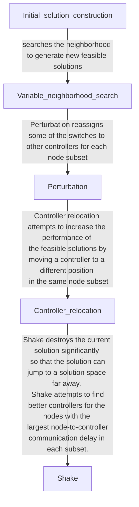

* content
{:toc}
[Controller placements for latency minimization of both primary and backup paths in SDNs](https://www.sciencedirect.com/science/article/pii/S0140366420319150)

## Controller placements for latency minimization of both primary and backup paths in SDNs

###  Problem

* 主路径延迟和备用路径延迟的两个目标本质上是冲突的。假设网络是理想的，则倾向于将控制器放置在靠近交换机的位置，以减少主要路径上交换机到控制器之间的延迟。但是，由于发生链接故障时绕行路径较长，因此备用路径延迟可能会很高。

### Methods

* 提出了一种新颖的多目标SDN控制器放置问题，以在没有链路故障和同时发生单链路故障的情况下将切换到控制器的通信延迟降到最低。
* 提出了一种有效的基于元启发式的可靠性感知和面向延迟的控制器放置算法（RALO），用于多目标多控制器放置。该算法通过具有网络分区的贪婪方法构造初始可行解，然后通过可变邻域搜索重复编辑生成新解。同时，为了避免陷入局部最优，该算法对当前解执行微扰和破坏操作。

根据各种限制条件抽象成数学表达式，包含约束条件和目标函数，之后为该NP问题提出一个算法解。通过将网络节点划分为多个交换机子集并根据交换机到控制器的通信延迟和控制器处理能力在每个交换机子集中分配一个控制器来构造一个初始可行的解决方案，之后使用可变邻域搜索(VNS)生成新的解决方案，检验该方案是否是可行解，并更新不符合条件的方案。

### 流程

**算法的初始可行解决方案的构建流程：**

* 构造分为两个步骤：节点子集划分和控制器在每个节点子集中的放置。

* 算法1继续在参数𝑟𝑚𝑎𝑥确定的最大迭代次数内迭代找到新解。在每次迭代期间，扰动控制器和开关之间的映射关系，并执行变量邻域搜索，然后改变控制器的位置。
* 如果当前解比所有找到的Pareto最优解差，则当前解决方案会受到Shakes的极大干扰，因此该解可以跳到另一个解空间以避免陷入局部最优。

* 每次找到潜在的控制器位置后，算法2会更新所有节点的𝐿𝑖，然后选择具有最大𝐿𝑖的节点作为下一个潜在的控制器位置；

* 算法3在算法2获得的每个节点子集中选择每个控制器的位置，并在约束条件下将每个节点映射到控制器。在算法3中，将两跳中的节点当中具有最大请求数的那个节点选为每个子集中的控制器位置。该算法按请求数量的非升序对每个子集𝑆𝑘中的所有其他节点进行排序，并在控制器的约束下将每个节点分配给控制器。

### Experiment

在仿真中使用的网络拓扑是Internet拓扑zoo中的8种实际网络拓扑，以及由斯坦福网络分析平台（SNAP）生成的两种网络拓扑（生成网络I和生成网络II）。生成网络I是符合ER（Erdos-Renyi）随机模型的一组网络拓扑，而生成网络II是符合小世界模型的一组网络拓扑。每种生成网络均包含10种网络拓扑。

文章共比较了LARC、RALO、PSA、Survivor和OPT共五种算法在主要路径和备份路径上的平均延时和累计延时，以及运行时间等评估指标上的差异。

### Limits

* 假设网络中最多存在一个链路故障，因为网络中多链路故障的可能性很小。