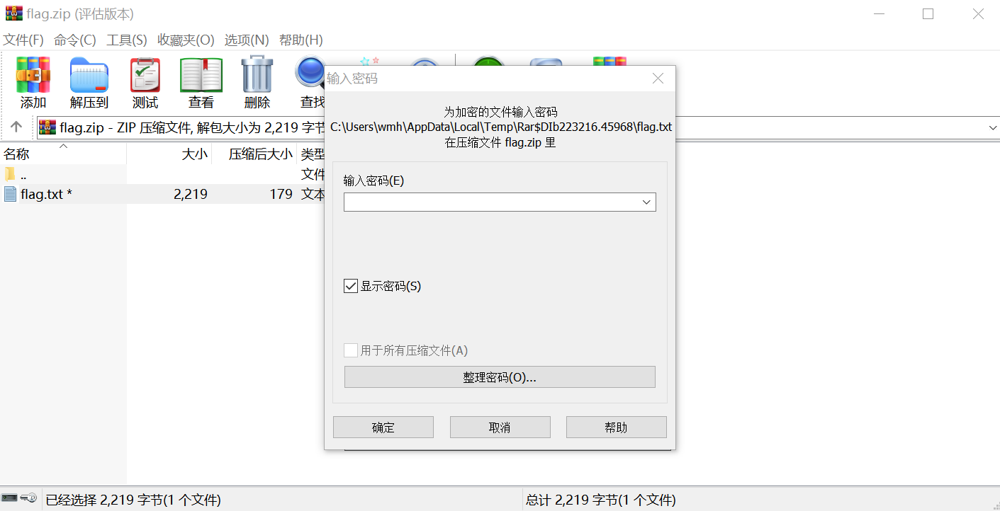
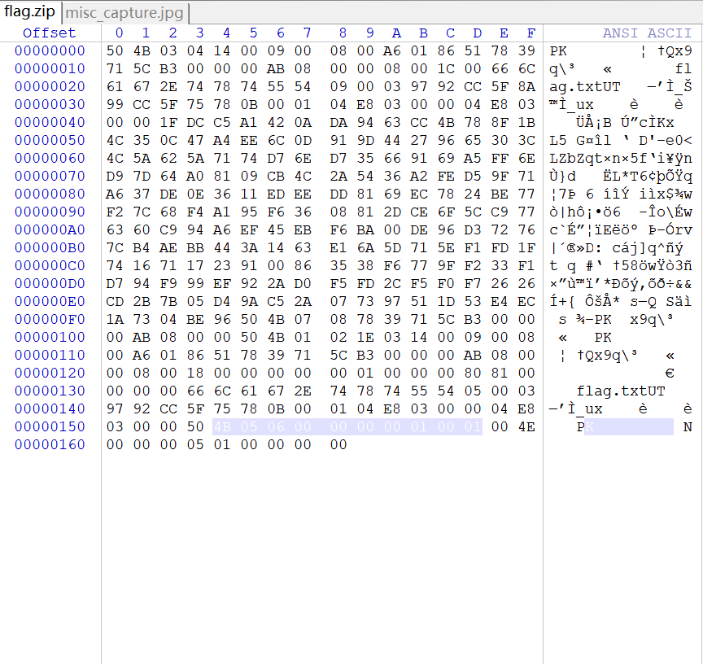
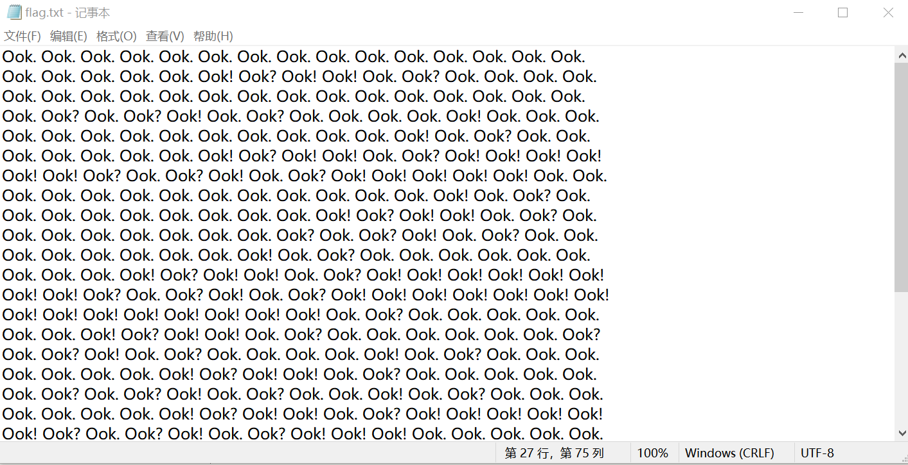

## 12月赛

记12月月赛

### misc

#### capture

图片隐写题，binwalk查看该图片后发现里面有一个zip文件

使用dd if=misc_capture.jpg of=flag.zip skip=1230723 bs=1后分离出zip文件，打开该文件后果然发现其中有个flag.txt，但是想要查看该文件的内容时，却发现它被加密了。

接下来有两个思路：（1）判断是否是伪加密；（2）尝试解密。

（1）使用winhex修改后提示该文件已被损坏，判断不是伪加密。

（2）解密的思路也有两个流程，首先在图片文件中查找是否存在关于密码的提示，没有找到只能尝试暴力破解。

使用azpr暴力破解后得到密码122947，这里绕了点弯子，因为没有找到提示，所以最开始使用了字母、数字、特殊字符暴力跑的，导致一直没有出结果，以为自己是哪里出了错。后来尝试只用数字之后，蛮快就出结果了，但还是没找到关于密码位数、组成的提醒orz。

打开flag.txt文件后，如下图所示：

之后就比较简单了，直接找一个在线解码工具即可，flag{doyouknowook}。

### Crypto

#### affine

