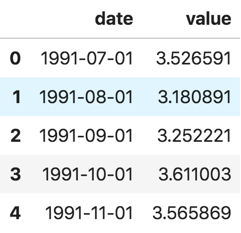
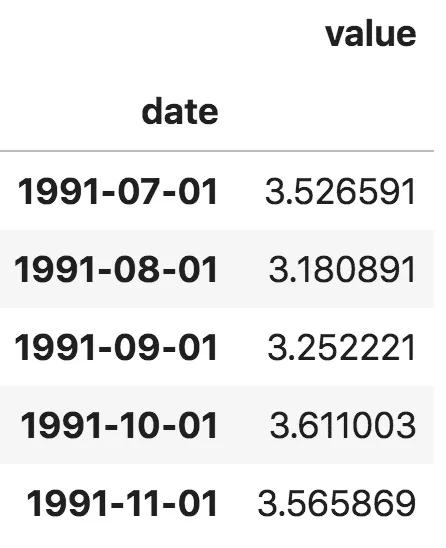
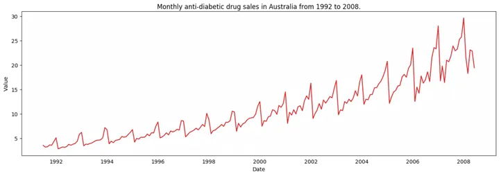

# 基于时间序列的预测算法

## 时间序列

### Introduction to Time Series Forecasting

时间序列是按常规时间间隔记录的一系列观测结果。

### How to import time series in python？

时间系列的数据通常以.csv文件或其他电子表格格式存储，并包含两列：日期和观测值。

使用包panda中的read_csv()函数来读取时间序列的数据集作为pandas的数据框架。添加parse_dates=["日期"]参数将日期列解析为日期字段.

```python
from dateutil.parser import parse 
import matplotlib as mpl
import matplotlib.pyplot as plt
import seaborn as sns
import numpy as np
import pandas as pd
plt.rcParams.update({'figure.figsize': (10, 7), 'figure.dpi': 120})

# Import as Dataframe
df = pd.read_csv('https://raw.githubusercontent.com/selva86/datasets/master/a10.csv', parse_dates=['date'])
df.head()
```



或者，可以用日期作为索引导入它作为panda系列，在pd.read_csv()中指定index_col参数。

```python
ser = pd.read_csv('https://raw.githubusercontent.com/selva86/datasets/master/a10.csv', parse_dates=['date'], index_col='date')
ser.head()
```



在该系列中，"value"列的放置高于'date'，以表示它是一个系列。

### What is panel data?

panel data同样也是基于时间的数据集。不同的是，除了时间系列之外，它还包含一个或多个用于同一时间段的相关变量。

```python
# dataset source: https://github.com/rouseguy
df = pd.read_csv('https://raw.githubusercontent.com/selva86/datasets/master/MarketArrivals.csv')
df = df.loc[df.market=='MUMBAI', :]
df.head()
```


### 可视化

 matplotlib

```python
# Time series data source: fpp pacakge in R.
import matplotlib.pyplot as plt
df = pd.read_csv('https://raw.githubusercontent.com/selva86/datasets/master/a10.csv', parse_dates=['date'], index_col='date')

# Draw Plot
def plot_df(df, x, y, title="", xlabel='Date', ylabel='Value', dpi=100):
    plt.figure(figsize=(16,5), dpi=dpi)
    plt.plot(x, y, color='tab:red')
    plt.gca().set(title=title, xlabel=xlabel, ylabel=ylabel)
    plt.show()

plot_df(df, x=df.index, y=df.value, title='Monthly anti-diabetic drug sales in Australia from 1992 to 2008.')    
```



### Patterns in a time series

 Any time series may be split into the following components: **Base Level + Trend + Seasonality + Error**

(余额宝在2014-02-01~2014-07-31期间每日申购的总金额[（数据来自天池大赛）](https://tianchi.aliyun.com/competition/entrance/231573/information)


**趋势：**趋势是时间序列在某一方向上持续运动，现象是在较长时期内受某种根本性因素作用而形成的总的变动趋势。上图中可以看到从2014年2月到2014年4月，余额宝的申购资金一路下降，这是一个明显的趋势。

**季节变化：**许多时间序列中包含季节变化，现象是在一年内随着季节的变化而发生的有规律的周期性变动。上图中肉眼很难看出时间序列随季节变化，可以通过时间序列分解（STL）来展示序列中的季节变化。

**序列相关性：时间序列的一个最重要特征是序列相关性，又称为自相关性。**上图中可以看到，数据之间存在一定的正相关与负相关。例如某天的数据上升，它的前一天或者后一天也上升或者下降。**自相关性是时间序列可以预测未来的前提（序列中存在的规律），如果没有自相关性，就变成了白噪声（无规律）。**

**随机噪声：**它是时间序列中除去趋势、季节变化和自相关性之后的剩余随机扰动。由于时间序列存在不确定性，随机噪声总是夹杂在时间序列中，致使时间序列表现出某种震荡式的无规律运动。

**时间序列分析的核心就是挖掘该时间序列中的自相关性**

注意：如何区分循环和季节性？

如果模式不是基于固定日历的频率，则它是循环的。因为，与季节性不同，循环效应通常受商业和其他社会经济因素的影响。

### 时间序列分解

大多数情况下，业务分析人员很难从高高低低的曲线中找到数据的规律。**通过时间序列分解，可以帮助大家从时间序列的波动中挖掘信息。**

**时间序列分解的成功与否，取决于两个因素：一是数据序列本身是隐藏着规律的，不可预测的部分只是其中的一小部分；二是分解的方法要合适，尤其是周期的判断要准确。**

### 时间序列的平稳性

平稳性：时间序列的行为并不随时间而改变

平稳性是时间序列分析的基本假设。

那么，**为什么**我们需要**时间序列的统计性质**关于**时间平移不变**呢？因为我们研究时间序列很重要的一个应用（或者出发点），是希望通过时间序列的**历史数据**来得到其**未来的一些预测**。换句话说，我们希望时间序列在**历史数据上的一些性质，在将来保持不变**，这不就是时间平移的不变性么？反过来想，如果时间序列不是平稳的，由历史数据得到的统计性质对未来毫无意义，那么研究时间序列还有什么意义呢？


参考文献：

[1. 如何深入理解时间序列分析中的平稳性？](https://www.zhihu.com/question/21982358)

## ARIMA

### Introduction to ARIMA models

ARIMA, short for ‘Auto Regressive Integrated Moving Average’ is actually a class of models that ‘explains’ a given time series based on its own past values, that is, its own lags and the lagged forecast errors, so that equation can be used to forecast future values.

任何显示模式而不是随机白噪声的"**非季节性**"时间系列都可以使用 ARIMA 模型进行建模。如果是一个有季节性的时间序列，为ARIMA添加seasonal terms->SARIMA。

An ARIMA model is characterized by 3 terms: p, d, q

* p is the order of the AR term

* q is the order of the MA term

* d is the number of differencing required to make the time series stationary

### What does the p, d and q in ARIMA model mean

