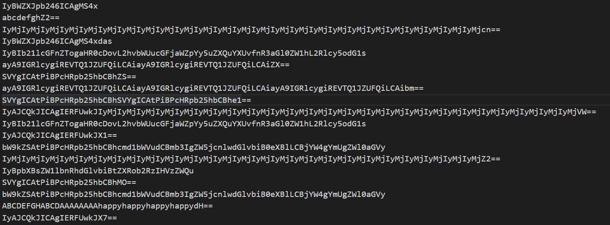

## crypto_babycry

babycry.txt文件打开后发现一个base64编码，对其进行解密，发现是个RSA题目

``` python
from gmpy2 import next_prime
from Crypto.Util.number import *

from secret import FLAG

BITS = 512

def N_generator(bits):
    p = getPrime(bits)
    q = getPrime(bits)
    N = p * q
    return N

e = 4
pt = bytes_to_long(FLAG)

N_list = [N_generator(BITS) for _ in range(3)]

ct_list = [pow(pt, e, N) for N in N_list]

print((N_list, e))
print(ct_list)

'''
(N_list, e) = ([172204460306124727344865726347192878366067097722462228080068318254297749421517487937395003309749238886950191100052973982367079997588685516708362201835600878310166867201741925343209424975747127144621314682665148525290082668089528074723134326386014280650280345539505618845632431897307492593132636318354738700863, 80873638714234866831106514066097645964632906015458416295194286199027631702775920934688726592490240875708919266195767198741426345601855683702301030166045344138529647996444890859050799748133511767252107576036918351018866474087463352446113805114192116422701109816228456666372293507159488583711066167613867221237, 146393208308151859944354545565004455075856073919753172632666999377776951721388279529867785679796331179024990176030106002819283606132040407465480677376737245373494460182325277898037899279482881441090887232644749909209414205823832815715999567866812065317417620023329811443071250489311707624765260649309804933429], 4)
ct_list = [116050676392720176850158375317761439015501956013131406319882459166446641553605645714183600176601985931304045605092972734847516232611666473497117395428201697452880334101202704630483177529623231050789318968824769783755119270421875186138344207137494904580594321188580614419608698336551418429665242429347028054136, 49860367840948097504389037629074939263518944946828155130281162527013675108095590293597971607812458710844689846036191232985530768355059909680837453496371887468295231350090031422388852697723693819619711612451996895726496087592141982948009355469793611760337309479164910362688385383013209012675369592360057955970, 97175471541299355878809869161134523846092684604200562572329712431668309522507183172010645480558108828208583221033976572545301992206033727945343713004325807855325222925794127188449134849619106461299187905116601484214218886394376453195828961803769362658073127524719683866245680983919925785348986920657771049561]

'''
#Tips: Zeropadding. the mode utilized is ECB with offset being 0. GB2312
#
#YEEU8ZMuK3utCJDHmEadXzIERS8fw+uk/PnkC9g2G/lc0nCuxNhNWV2v9Z8WmCzWQG0W9UsTX/z4QJJyWHRqHqw55kBdq0IBOBUdUl6tijvsaRJx9OBkFBd9xNkJ3qB5Yg/GDPTmnD+hIv+urrh1/Ulr6YIDSRkOUaQ4skTu8vdRoM7bYujWav0jp1npsXW2IGIm98fNf0U=
#
```

根据上面的内容敲exp，

```python

#Easy. Chinese reminder Theorem.

import time

import gmpy2

from gmpy2 import mpz

from Crypto.Util.number import *

ct_list = [116050676392720176850158375317761439015501956013131406319882459166446641553605645714183600176601985931304045605092972734847516232611666473497117395428201697452880334101202704630483177529623231050789318968824769783755119270421875186138344207137494904580594321188580614419608698336551418429665242429347028054136, 49860367840948097504389037629074939263518944946828155130281162527013675108095590293597971607812458710844689846036191232985530768355059909680837453496371887468295231350090031422388852697723693819619711612451996895726496087592141982948009355469793611760337309479164910362688385383013209012675369592360057955970, 97175471541299355878809869161134523846092684604200562572329712431668309522507183172010645480558108828208583221033976572545301992206033727945343713004325807855325222925794127188449134849619106461299187905116601484214218886394376453195828961803769362658073127524719683866245680983919925785348986920657771049561]

N_list = [172204460306124727344865726347192878366067097722462228080068318254297749421517487937395003309749238886950191100052973982367079997588685516708362201835600878310166867201741925343209424975747127144621314682665148525290082668089528074723134326386014280650280345539505618845632431897307492593132636318354738700863, 80873638714234866831106514066097645964632906015458416295194286199027631702775920934688726592490240875708919266195767198741426345601855683702301030166045344138529647996444890859050799748133511767252107576036918351018866474087463352446113805114192116422701109816228456666372293507159488583711066167613867221237, 146393208308151859944354545565004455075856073919753172632666999377776951721388279529867785679796331179024990176030106002819283606132040407465480677376737245373494460182325277898037899279482881441090887232644749909209414205823832815715999567866812065317417620023329811443071250489311707624765260649309804933429]

time_start = time.time()
N1 = gmpy2.mul(N_list[1], N_list[2])
N2 = gmpy2.mul(N_list[0], N_list[2])
N3 = gmpy2.mul(N_list[0], N_list[1])

N = gmpy2.mul(N1, N_list[0])

t1 = gmpy2.invert(N1, N_list[0])
t2 = gmpy2.invert(N2, N_list[1])
t3 = gmpy2.invert(N3, N_list[2])

x1 = gmpy2.mul(ct_list[0], gmpy2.mul(N1, t1))
x2 = gmpy2.mul(ct_list[1], gmpy2.mul(N2, t2))
x3 = gmpy2.mul(ct_list[2], gmpy2.mul(N3, t3))

ct = gmpy2.f_mod(gmpy2.add(gmpy2.add(x1, x2), x3), N)

e = 4
k = 0

while(gmpy2.iroot(ct + k * N, e)[1] == False):
	k += 1
time_end = time.time()

print(long_to_bytes(gmpy2.iroot(ct + k * N, e)[0]))

print('time_cost', time_end - time_start, 's')
```


得到一个flag：

```
flag = 5505813370
```

这个flag其实是DES ECB zeropadding 下根据base64 时所用的加密解密key，利用工具对代码后面部分注释中的内容进行解密，可以得到一段sage脚本

``` python
p = 13256276933
a = 2335346
b = 482735
k = 1234567
E = EllipticCurve(GF(p), [a, b])

P = E(13096176833, 4360783474)
Q = k * P
print(Q)
```

但是sage脚本中有一个地方错误，即P = (: : )，sage不允许这样的赋值，因此需要修改赋值情况为P = E(x,y)这种脚本才可以。利用sage计算Q点的值，得到Q点的横坐标，即为最后的flag。

## crypo_decode

打开文件得到一串base64编码，



经过多番搜索之后发现是base64隐写，贴个原理：

*base64之所以可以隐藏信息，在于在解密过程中,在解码的第3步中，会有部分数据被丢弃（即不会影响解码结果），这些数据正是在编码过程中补的0。也就是说，如果在编码过程中不全用0填充，而是用其他的数据填充，仍然可以正常编码解码，因此这些位置可以用于隐写。*

*解开隐写的方法就是将这些不影响解码结果的位提取出来组成二进制串（一行 base64 最多有 2 个等号, 也就是有 22 位的可隐写位.），然后转换成ASCII字符串。这就是为什么出base64隐写时会有很多大段 base64 的原因*

根据原理写一个exp：

``` python
base64chars = 'ABCDEFGHIJKLMNOPQRSTUVWXYZabcdefghijklmnopqrstuvwxyz0123456789+/'

flag = ''
with open('flag1.txt', 'r') as f:
    for line in f.readlines():
        line = line[:-1]
        num = line.count('=')
        if num == 0:
            continue
        lastchar = line[-(num + 1)]

        # print(line,num,lastchar)
        myindex = base64chars.index(lastchar)
        # print(myindex)
        bin_str = bin(myindex)[2:].zfill(6)
        # print(bin_str)
        flag += bin_str[6 - 2 * num:]
        # print(bin_str[6-2*num:])
print(''.join([chr(int(flag[i:i + 8], 2)) for i in range(0, len(flag), 8)]))
```

## crypto_easy

U2FsdGVkX19onaeEeDGRCz3TqWzFm3qrTsiew+f2V9iHpvDRMBej+JVb+5q0Kku1

根据提示得到AES密钥为6，解密得到lbh_zhfg_oryvrir_lbhefrys，又根据提示“加密=解密”得到rot13加密方式，解密得到flag

 ## misc_book_recommendation

1 打开flag.pptx，发现没有有价值的线索，用binwalk分析文件，并对其分离文件

2 解压后得到一张二维码图片，扫码信息为“你需要另一张图片，来与这个二维码进行某种操作。快去找找吧！”

3 解压后在pptx的描述文档Content_Types里找到注释“<!--Flag may be on https://t.bilibili.com/509511497886878745?tab=2>”

4 依据提示网址，找到另一张图片，是一张近似于二维码的乱码图

5 将两张图片进行异或，得到新的二维码图片

6 扫描新的二维码，进入公众号，依据提示在后台回复“flag”

## misc_crypto

将题目给的pyc文件在线反编译，得到python源码

``` python
#! /usr/bin/env python 2.7 (62211)
#coding=utf-8
# Compiled at: 2021-04-02 22:53:15
#Powered by BugScaner
#http://tools.bugscaner.com/
#如果觉得不错,请分享给你朋友使用吧!
import string
this_is_not_flag = ''
 
def convert(str1):
    str = list(str1)
    i = 0
    while i < len(str):
        if str[i] == '{':
            str[i] = 'o'
        if str[i] == '}':
            str[i] = 'o'
        if str[i] == '+':
            str[i] = 'q'
        if ord(str[i]) < 58 and ord(str[i]) > 47:
            str[i] = chr(ord('g') + ord(str[i]) - 48)
        i = i + 1
 
    return ('').join(str)
 
 
def crypto(str_raw, k):
    str_change = str_raw.lower()
    str_list = list(str_change)
    str_list_encry = str_list
    i = 0
    while i < len(str_list):
        if ord(str_list[i]) < 123 - k:
            str_list_encry[i] = chr(ord(str_list[i]) + k)
        else:
            str_list_encry[i] = chr(ord(str_list[i]) + k - 26)
        i = i + 1
 
    return ('').join(str_list_encry)
 
 
code1 = convert(this_is_not_flag)
code2 = crypto(code1, 17)
print code2
```

是一段加密代码，程序的加密功能是所给字母串进行位移17的凯撒密码加密，依据提示wcrxfdyathgptwzyvf得到flagomhjcqpycfiheo，根据convert函数复原为flag{m13c+pYcFi1e}

## misc_something in depth

hint：What does this look like from **left**?


没太明白

## misc_v2

拿到一个gif文件，组合得到一个二维码图片

 

扫描该二维码获得文字：Ntqiziqzoldt，看起来很像某种加密方式处理flag后得到的文字。

GIF最后还有个问题，该问题答案为：没错，就是我。所以flag可能是xxxxxxxxisme，尝试了多种加密方法后，键盘密码得到的结果是可行的yeahthatisme

## re_easy


## web_easy

在js文件搜索flag，找到如下文字：

``` javascript
alert('成功  flag{t8IYRNTIVjoQneD7tMIX8+EMZNYmNKRL} -USTC -DES')
```

可以看到是des解密，密钥USTC，在函数里还发现一个注释：pad=10126，所以采用iso-10126的方式填充，得到最后的flag